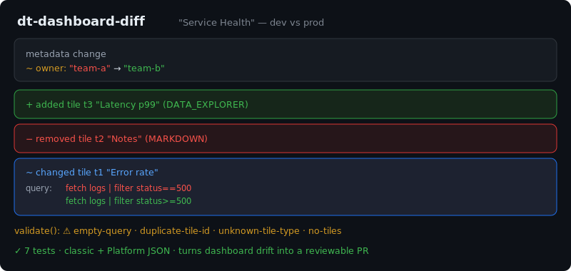

# dt-dashboard-diff

[](https://github.com/JCreatesGH/dt-dashboard-diff/actions)
[](https://www.typescriptlang.org/)
[](LICENSE)

Treat **Dynatrace dashboards as code**. `dt-dashboard-diff` validates a dashboard's JSON and diffs two dashboards (dev vs prod, or before vs after) so configuration drift becomes a reviewable, reportable change instead of a mystery.



## Install

```bash
npm install dt-dashboard-diff
```

## Diff

```ts
import { parseDashboard, diffDashboards, hasChanges } from "dt-dashboard-diff";

const diff = diffDashboards(parseDashboard(devJson), parseDashboard(prodJson));

diff.metadata        // { owner: ["team-a", "team-b"] }
diff.addedTiles      // tiles only in prod
diff.removedTiles    // tiles only in dev
diff.changedTiles    // per-tile field changes (name/type/query)
hasChanges(diff)     // gate a deploy on this
```

`renderDiff(diff)` turns that into a compact, PR-comment-ready summary.

## Validate

```ts
import { validate } from "dt-dashboard-diff";
validate(parseDashboard(json));
// HIGH no-tiles / duplicate-tile-id · MEDIUM unknown-tile-type · LOW empty-query
```

## CLI

Installing the package adds a `dt-dashboard-diff` command — one file validates, two files diff:

```bash
$ dt-dashboard-diff dashboard.json                 # validate (exit 1 on a HIGH issue)
$ dt-dashboard-diff dev.json prod.json             # human-readable diff
$ dt-dashboard-diff dev.json prod.json --exit-code # exit 1 on any drift (gate CI)
$ dt-dashboard-diff dev.json prod.json --json      # structured diff
```

## Notes

- **Tolerant parser** — normalizes both classic and Platform dashboard shapes (tiles as an array or an id-keyed object; `tileType`/`type`/`visualization`).
- Diffs tiles by **id**, reporting added, removed, and field-level changes — so a tweaked query shows up as a clean before/after.

Wire it into CI to block accidental dashboard drift between environments.

## Development

```bash
npm install && npm test    # 13 tests
npm run build              # tsc, clean
```

## License

MIT
